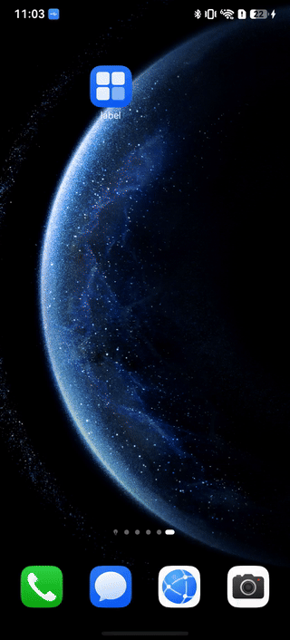

> **Note:** To access all shared projects, get information about environment setup, and view other guides, please visit [Explore-In-HMOS-Wearable Index](https://github.com/Explore-In-HMOS-Wearable/hmos-index).

# AppLock

A HarmonyOS library for application lock functionality using biometric authentication (Face, Fingerprint, PIN).

## How to Install

```bash
ohpm install @explore-in-hmos/app_lock
```

For details about the OpenHarmony ohpm environment configuration, see [OpenHarmony HAR](https://gitcode.com/openharmony-tpc/docs/blob/master/OpenHarmony_har_usage.en.md).

## Exported Components

### AppLock

A UI component that wraps your application content and displays a lock screen when the app is locked.

**Component Signature:**
```typescript
@Component
struct AppLock
```

**BuilderParam:**

| Parameter | Type | Description |
|-----------|------|-------------|
| page | () => void | The page builder to render when app is unlocked |

**StorageLink Properties:**

| Property | Type | Default | Description |
|----------|------|---------|-------------|
| isAppLockActive | boolean | false | Controls whether app lock feature is enabled |
| isAppLockLocked | boolean | false | Controls whether app is currently locked |

**Behavior:**
- When `isAppLockActive` is `true` and `isAppLockLocked` is `true` and biometric is available, displays a lock screen
- When unlocked or biometric unavailable, renders the wrapped page content
- Lock screen shows a lock icon and an unlock button that triggers `AppLockController.tryUnlock()`

---

### AppLockController

Static controller class for managing app lock state and authentication.

```typescript
class AppLockController
```

#### Methods

##### `init(): void` (Mandatory)

Initializes persistent storage for app lock state. Must be called once, typically after `windowStage.loadContent()`.

```typescript
AppLockController.init()
```

---

##### `setIsActive(isActive: boolean): void`

Enables or disables the app lock feature.

```typescript
AppLockController.setIsActive(true)   // Enable app lock
AppLockController.setIsActive(false)  // Disable app lock
```

| Parameter | Type | Description |
|-----------|------|-------------|
| isActive | boolean | `true` to enable, `false` to disable |

---

##### `onBackground(): void` (Optional)

Locks the app when it goes to background. Call this in `EntryAbility.onBackground()` or via `windowStage.on('windowStageEvent')`.

```typescript
AppLockController.onBackground()
```

---

##### `isAppLockActive(): boolean`

Returns whether app lock feature is currently enabled.

```typescript
const isActive: boolean = AppLockController.isAppLockActive()
```

**Returns:** `boolean` - `true` if app lock is active, `false` otherwise

---

##### `tryUnlock(): void` (Optional)

Initiates biometric authentication to unlock the app. Supports Face, Fingerprint, and PIN authentication.

```typescript
AppLockController.tryUnlock()
```

---

## EntryAbility Configuration

### Basic Setup (Mandatory)

In your `EntryAbility.onWindowStageCreate()`, call `init()` after loading content:

```typescript
import { AppLockController } from 'app-lock';

windowStage.loadContent('pages/Index', (err) => {
  if (err.code) {
    return;
  }
  AppLockController.init() // mandatory
});
```

### Lock on Background (Optional)

To lock the app when user navigates to recent apps or switches away, use the `windowStage.on('windowStageEvent')` listener:

- Basic option: Lock when app goes to background. This option does not lock app when it moves to recent apps.
```typescript
onBackground(): void {
  AppLockController.onBackground()
}
```
- Advanced option: Lock when app goes to recent apps.
```typescript
onWindowStageCreate(windowStage: window.WindowStage): void {
  windowStage.on('windowStageEvent', (event) => {
    if (event === window.WindowStageEventType.PAUSED || event === window.WindowStageEventType.INACTIVE) {
      AppLockController.onBackground()
    }
  });

  windowStage.loadContent('pages/Index', (err) => {
    // ...
    AppLockController.init()
  });
}
```

### Try Unlock on App Open (Optional)

To automatically prompt for authentication when the app opens, call `tryUnlock()` when the window is resumed:

```typescript
onWindowStageCreate(windowStage: window.WindowStage): void {
  windowStage.on('windowStageEvent', (event) => {
    if (event === window.WindowStageEventType.PAUSED || event === window.WindowStageEventType.INACTIVE) {
      AppLockController.onBackground()
    } else if (event === window.WindowStageEventType.RESUMED) {
      AppLockController.tryUnlock() // Auto unlock
    }
  });

  windowStage.loadContent('pages/Index', (err) => {
    // ...
    AppLockController.init()
  });
}
```

---

## Usage Example

### main_pages/index.ets

```typescript
import { AppLock, AppLockController } from 'app-lock';

@Entry
@Component
struct Index {
  @State appLockOn: boolean = AppLockController.isAppLockActive();

  build() {
    Column() {
      AppLock() {
        Column({ space: 32 }) {
          Text('App Content')
            .fontSize(32)

          Row({ space: 16 }) {
            Text('AppLock:')
            Toggle({ type: ToggleType.Switch, isOn: this.appLockOn!! })
              .onChange((isOn: boolean) => {
                AppLockController.setIsActive(isOn)
              })
          }
        }
        .size({ width: '100%', height: '100%' })
        .justifyContent(FlexAlign.Center)
        .padding(16)
      }
    }.size({ width: '100%', height: '100%' })
  }
}
```

---



## Permissions

The library uses the following permission in `app-lock/module.json5`:

```json
{
  "module": {
    "name": "app-lock",
    "type": "har",
    "requestPermissions": [{
      "name": "ohos.permission.ACCESS_BIOMETRIC"
    }]
  }
}
```

---

## Supported Authentication Methods

- Face Recognition
- Fingerprint
- PIN

The `AppLock` component automatically checks availability and uses the best available method.

## LICENSE

MIT